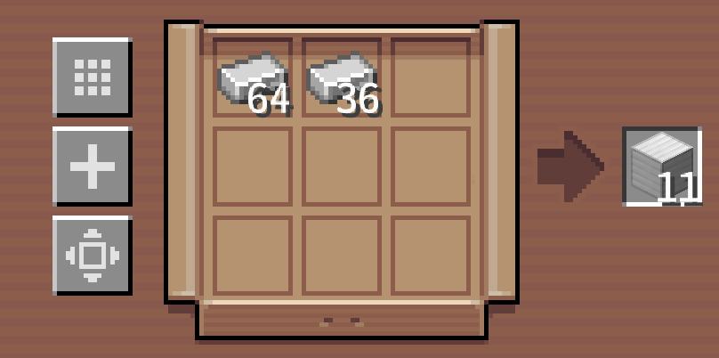
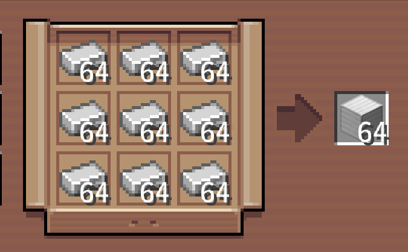
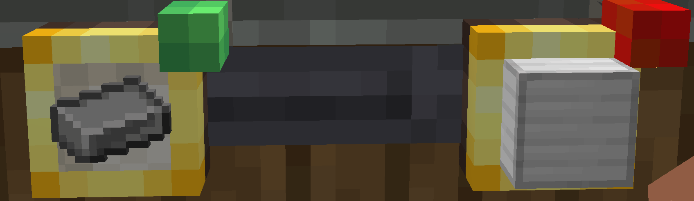

# Factory Gauge Improve


Lifts both amount ceilings of Create's factory gauges: **one input connection can carry up to 576
items** (nine cells of one stack — exactly one full package), and **one request can ask for up to
46656 product**.

| | |
|---|---|
| Minecraft | 1.21.1 |
| NeoForge | 21.1.x |
| Create | 6.0.10 |
| Environment | **client only** (the server does not need it) |

## What it changes

Vanilla clamps one input connection to 1–64, and **a cell *is* the connection**: nine stacks of iron
ingots means nine identical gauges on the wall, and a production line can never be tuned to a batch.

This mod keeps **one cell = one stack** and spills anything above that into the following empty
cells, so a cell never holds a number larger than a stack.

100 items — the surplus spills into the next cell:



576 items — nine full cells, one whole package:



| | Vanilla | This mod |
|---|---|---|
| Amount per input connection | ≤ 64 | ≤ **576** (nine cells — one package) |
| A single cell | ≤ 64, and that cell is everything | ≤ 64, the rest **spills into later cells** |
| 576 iron ingots | nine gauges | one gauge, nine Ctrl-scrolls |
| Grid full | — | refuses a tenth connection |
| Expected output (product per request) | ≤ 64 | ≤ **46656**, configurable |

Since a Create package holds 9 × 64, a gauge can no longer describe an order that a single package
cannot carry — which is what used to force nine gauges onto one wall.

The limit counts **cells of the grid the new connection is going into**, and only that: when you
click one gauge and then another, the connection lands on the one you clicked **first**, so it is
*that* gauge's own inputs that decide whether there is room. A gauge that feeds nine downstream
inputs is not blocked by it, and being pointed at by other gauges never costs a gauge a cell of its
own.



## Using it

**Scroll** ±1 · **Shift + scroll** snaps to multiples of 8 · **Ctrl + scroll** snaps to multiples of
64 (one whole cell).

The steps snap to multiples instead of adding a step, so every exact number stays reachable: jump
close with a big step, fine-tune with ±1.

* Which **cell** the cursor is over only picks **which connection** you are editing. The wheel edits
  that connection's **total**, and its cells are re-derived from it.
* **A cell fills up before the next one opens**: a total of 128 occupies two cells (`64, 64`); the
  136th item is what opens a third.
* Scrolling the last cell back to empty **retracts** it.
* Gauges placed on a **Packager** work the same way — it is the same 3×3 input grid.
* The **expected output** slot ("how much product one request asks for") is a single number with no
  grid behind it, so it has a ceiling of its own: `limits.maxRequestedOutput`.

## Installing

1. Install **NeoForge 21.1.x** and **Create 6.0.10** (Fabric is not supported).
2. Drop `factorygaugeimprove-1.2.2-for-create-6.0.10-neoforge-1.21.1.jar` into `.minecraft/mods`.
3. Single-player works immediately; on a server only **your own client** needs the mod.

## Configuration

`config/factorygaugeimprove-client.toml`

```toml
[limits]
    perCell = 64               # items per cell; 64 = one stack = one cell of a package
    maxCells = 9               # how many cells an input may use; 9 = the whole 3x3 = one package
    spillToEmptyCells = true   # false = do not spread out, just let one cell exceed a stack
    maxRequestedOutput = 46656 # ceiling of the "expected output" slot

[scroll]
    shiftStep = 8              # Shift snaps to multiples of this
    ctrlStep = 64              # Ctrl snaps to multiples of this

[diagnostics]
    logToConsole = true        # write layout/scroll decisions to the log (prefix [fgi])
```

* Raising `perCell` (128, say) allows bigger batches but **drops the "one gauge ≤ one package"
  guarantee**.
* Once you are used to the mod, turn `logToConsole` off — it writes a line per scroll notch.

## Messages you may see

| Message | Meaning |
|---|---|
| No free cell: lower one of this gauge's input amounts first | that panel's grid is already spending all nine cells; the new connection is refused |
| Input grid is full: a gauge holds at most 9 cells (one package) | you kept scrolling up at the ceiling |
| An input needs more than 9 cells; the rest cannot be shown: lower it | the existing input needs more cells than are available (`maxCells` was lowered, or the amount predates it) |

## Notes

* **Client-side only.** Someone without the mod who opens the same gauge will have it clamped back to
  64 as soon as they scroll — expected.
* Amounts are plain numbers in the block's NBT, so **removing the mod keeps the values**; you just
  cannot raise them further.
* Every injection is declared as required, so if Create changes one of the patched methods the mod
  fails loudly at load time instead of silently falling back to a 64 ceiling.
* Next to other mods that patch the gauge screen, the immediate refresh can be lost, but the
  fallback layout on scroll always runs.
* Not done on purpose: a tenth input connection per grid, or the same source connected twice to one
  gauge (Create keys connections by source, and requests are merged per item anyway).

## Building

```bash
gradlew.bat build -x test          # jar -> build/libs/
gradlew.bat checkAmounts           # offline assertions on the amount arithmetic
```

Create, Flywheel and Ponder are `compileOnly` and are not redistributed here — put these three jars
in `libs/` before building (create-1.21.1-6.0.10, flywheel-neoforge-1.21.1-1.0.6,
ponder-neoforge-1.0.82+mc1.21.1).

## License

MIT © ZhaiDu11264.
